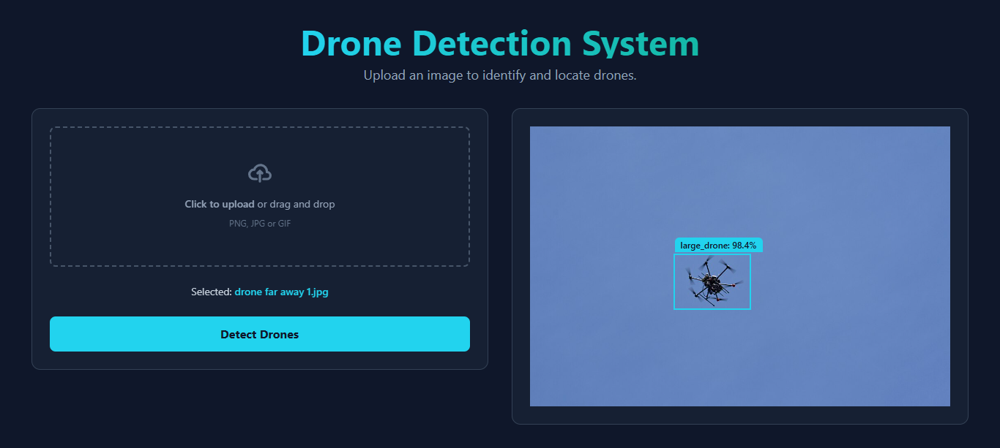

<div align="center">
  
</div>

# ✈️ Drone Detection System (Frontend)

This repository contains the **React frontend** for the Drone Detection System, a full-stack, decoupled computer vision application. This user interface was initially bootstrapped using Google AI Studio and then customized to connect to a dedicated backend API that performs object detection.

The application features a modern, dark-themed UI where users can upload an image. The frontend sends this image to a backend API and receives JSON data containing the coordinates and labels of detected drones. It then dynamically renders these bounding boxes over the original image, providing an interactive and intuitive user experience.

---

### 🔗 Project Links

This project is a key component of a larger full-stack system. Here are all the relevant links:

| Link                               | URL                                                                                                         |
| :--------------------------------- | :---------------------------------------------------------------------------------------------------------- |
| 🚀 **Live Demo**                   | **[drone-detection-frontend.vercel.app](https://drone-detection-frontend.vercel.app/)** |
| 🎨 **Frontend Repository (This Repo)** | [github.com/MdEhsanulHaqueKanan/drone-detection-frontend](https://github.com/MdEhsanulHaqueKanan/drone-detection-frontend) |
| ⚙️ **Backend API Repository (Flask)** | [github.com/MdEhsanulHaqueKanan/drone-detection-api](https://github.com/MdEhsanulHaqueKanan/drone-detection-api)       |
| 📦 **Original Monolithic Project** | [github.com/MdEhsanulHaqueKanan/drone-detection-deep-learning-flask-app](https://github.com/MdEhsanulHaqueKanan/drone-detection-deep-learning-flask-app) |

**Note on Live Demo:** The backend API is hosted on Hugging Face's free community tier. If the app has been inactive, it may "sleep" to save resources. Your first prediction might take **30-90 seconds** as the server wakes up. Subsequent predictions will be much faster!

---

### ✨ Features

*   **Modern UI/UX:** A sleek, dark-themed interface built with React, TypeScript, and Vite.
*   **Client-Side Rendering:** Dynamically draws bounding boxes over the source image based on JSON data from the API, a more flexible and efficient approach.
*   **Responsive Design:** A two-column layout that gracefully stacks on mobile devices.
*   **Interactive Feedback:** Includes drag-and-drop support, loading skeletons, and smooth animations.
*   **Decoupled Architecture:** Communicates with a remote Python/Flask backend hosted on Hugging Face Spaces.

### 💻 Local Setup

**Prerequisites:** [Node.js](https://nodejs.org/) (v18 or higher recommended)

1.  **Clone the repository:**
    ```bash
    git clone https://github.com/MdEhsanulHaqueKanan/drone-detection-frontend.git
    cd drone-detection-frontend
    ```

2.  **Install dependencies:**
    ```bash
    npm install
    ```

3.  **Run the development server:**
    ```bash
    npm run dev
    ```
The application will be available at `http://localhost:5173`.

**Note:** This frontend is configured to connect to the live API deployed on Hugging Face. The backend does not need to be run locally for this frontend to work.

---